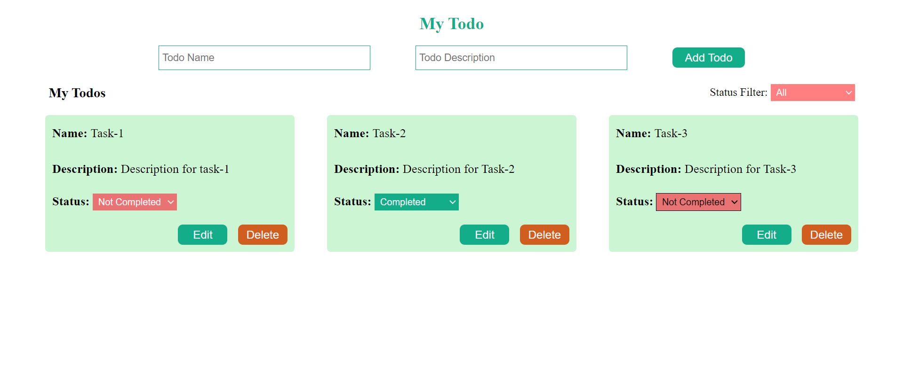

# React Todo-List

This Todo-List project was created as part of the Guvi-Zen class Roadmap session on Day-25, specifically focusing on React Day-5 Task.

## Tech Stack

- HTML
- CSS
- JavaScript
- React

## Features

- CRUD operations for managing daily tasks
- Responsive and attractive design for user interaction

## Learning Experience

During the development of this project, I gained knowledge in:

- Implementing CRUD operations
- Creating, reading, updating, and deleting component elements in React
- Understanding how React manipulates the browser DOM

## Website Preview

## Setup

To run this project, ensure that you have Node Package Manager (NPM) installed.

## Deployment

The application is deployed and can be accessed here : [Todo App](https://mytodo-netlify.netlify.app).
